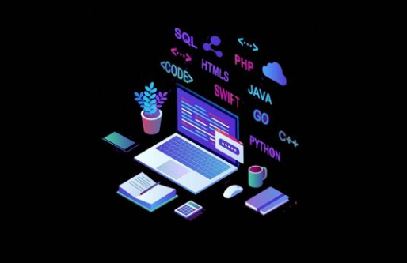

# stack.dev - Full Stack Development

Welcome to **stack.dev**! This repository is dedicated to providing information, training, tech news, and guidance related to Full Stack Development and Software Development. Whether you're an aspiring developer or an experienced professional, we aim to provide valuable resources to enhance your skills.

## Table of Contents

- Introduction
- Front End
- Back End
- Database
- Technology Stacks
- Quick Review
- Popular Stacks
- Register for a Course
- External Resources
- Contact
- License

## Introduction

**stack.dev** focuses on Full Stack Development, which involves building both the front-end (client-side) and back-end (server-side) portions of web applications. This repository provides educational content, articles, and video resources to help you understand and excel in various aspects of full-stack development.

## Front End

The front-end is all about creating the user interface and experience. It involves technologies like HTML, CSS, and JavaScript. Here are some key technologies in the front-end realm:

- HTML: Hyper Text Markup Language
- CSS: Cascading Style Sheets
- JavaScript: Interactive scripting language

For more details on front-end libraries and frameworks, refer to the [Front End Libraries and Frameworks](#front-end-libraries-and-frameworks) section.

## Back End

The back-end is responsible for server-side logic and data handling. It involves technologies like PHP, Python, Java, Node.js, and more. Here are some key back-end technologies:

- PHP: Server-side scripting language
- Python: General-purpose programming language
- Node.js: JavaScript runtime for server-side development

Learn more about back-end frameworks and languages.

## Database

The database is where data is stored, managed, and retrieved. It plays a crucial role in web applications. Here are some database technologies:
For further insights into databases, explore the Database

## Technology Stacks

Technology stacks combine various technologies to build full-stack applications

## Quick Review

Front-end, back-end, and database are the three pillars of full-stack development. 

## Popular Stacks

- MEAN Stack
- MERN Stack
- Django Stack
- Rails Stack
- LAMP Stack

## Register for a Course

Ready to learn more about full-stack development? [Register for a Course](register.html) and take your skills to the next level!

## External Resources

- CodePen Explore front-end code snippets and experiments.
- Replit Collaborate on coding projects in the browser.

## Contact

Developed by Guna Palanivel from India. Feel free to reach out for inquiries or collaborations!

## License

This project is licensed under the MIT License
